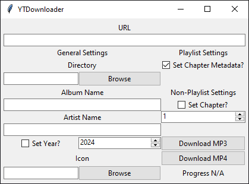
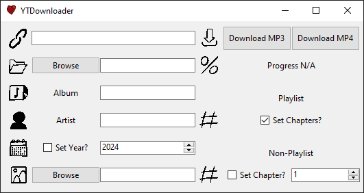
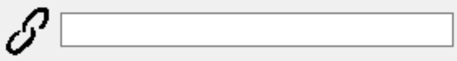
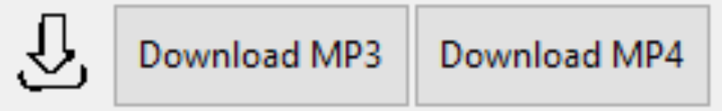
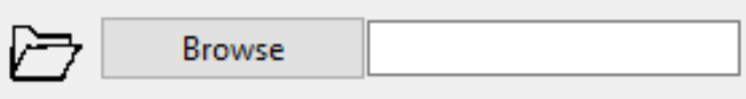
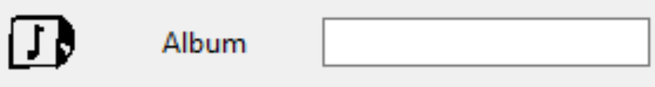
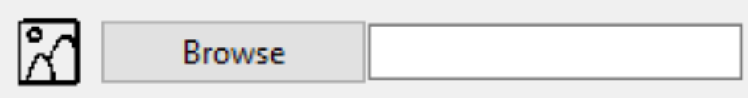
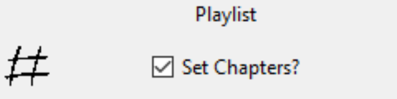
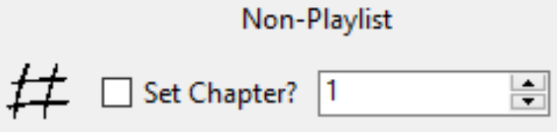
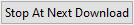

# YTDownloader
YTDownloader will take a youtube video or playlist url and download it/them as MP3 or MP4, setting some metadata as explained below.

I made this python application because I'm sick and tired of all those dumb websites that are terrible at the one thing they set out to do. Turns out it's actually really easy to download youtube videos. I haven't actually tested the max quality this is capable of - one way to find out!  

## Ways to Run
There are two versions, one for command line, and one for gui. The gui version can also be run with a single command line option for the directory (which is used in the context menu - more on that later).

### Command-line
To run this version of the program, run the program with more than zero command line arguments (e.g. `-h`).

#### Usage
```bash
Usage: ./YTDownloader.exe [-h] [-a ALBUM] [-A ARTIST] [-c CHAPTER] [-C] [-i ICON] [-n NAME] [-o OUTPUT] [-u URL] [-v] [-y YEAR]
To run using a GUI, run with no command line arguments

OPTIONS:
  -a, --album           <NAME>  Album name for folder and metadata.
  -A, --artist          <NAME>  Artist name for metadata.
  -c, --chapter         <NUM>   Chapter number for non-playlist downloads.
  -C, --set-chapters            Set chapters for metadata for items in playlists.
  -i, --icon            <PATH>  Path to ico/png/jpg/jpeg file to use as file icon/s
  -o, --output          <PATH>  Base output folder (default: downloads/audio or downloads/video).
  -u  --url             <URL>   URL for youtube video or playlist.
  -v, --video                   Download as MP4 instead of MP3.
  -y, --year            <YEAR>  Year to include in the metadata.
```

### GUI
To run using a GUI, use the file with `_gui` in its name. I made two versions of this because my friend liked the retro look.  

#### Retro


#### Updated


## Functionality
There are quite a few functions that the script can handle, most of them are optional. However, you will need to give a URL and filetype.  
List of metadata that can be set:
 - Album
 - Artist
 - Year
 - Track Number
 - Comment (This is set to the url of the video)

### Required
#### URL
The URL can be given for a single video, or for an entire playlist. The application will figure out which one you've given, so there's no need to have an option for it.  
Command line option: `-u <URL>` or `--url <URL>`  


#### Filetype
You need to set if you want to download as MP3 (audio), or MP4 (video). In the GUI, you can select the filetype by clicking the different buttons for `Download MP3` or `Download MP4`. To download as MP4 in command-line, provide the `-v` or `--video` option. The command-line application will download as MP3 if no `video` flag is set.  


### Optional - General
#### Output Directory
Where to download the MP3/MP4 file/s to. If not specified, will create a `downloads` directory and download into there, with subdirectories for `audio` or `video`. If a path is given, no additional subdirectories are created.  
Command line option: `-o <PATH>` or `--output <PATH>`  


#### Album
What to set the `album` metadata to. Also will group downloads into a subdirectory with the same name as the album - unless an output directory is specified.  
Command line option: `-a <NAME>` or `--album <NAME>`  


#### Artist
What to set the `artist` metadata to.  
Command line option: `-A <NAME>` or `--artist <NAME>`  


#### Year
What to set the `year` metadata to (from 0 to 2100).  
Command line option: `-y <YEAR>` or `--year <YEAR>`  


#### Icon
Sets the icon for the files when shown in file explorer.  
Command line option: `-i <PATH>` or `--icon <PATH>`  


### Optional - Playlists
#### Set Chapters
The `track` metadata in playlists will always be set (it's much easier to manually remove the track than to add a unique value for each file) - the first item is set as track `1`, the second as track `2`, etc.  
If the `set-chapters` flag is set, playlist files will be titled `<title> Chapter <track>` for MP3, and `<title> Episode <track>` for MP4. If the flag is not set, the files will be titled `<title>`.
Command line option: `-C` or `--set-chapters`  


### Optional - Non-Playlists
#### Chapter
Sets the `track` metadata to the given number (0 to maxint).  
Command line option: `-c <NUM>` or `--chapter <NUM>`  


### Other
#### Progress
Shows the progress of what you're downloading. Works with playlists (e.g. `3 of 20` / `6 of 10`), and also for non-playlists (e.g. `Downloading` / `Done!`).  


#### Stop At Next Download
This is only in the GUI version. Clicking this button will stop a playlist download after the current video is processed. It's not feasible to stop during the processing of a video because the downloading is done in a third party library, and stopping before updating the metadata would leave one file non-homogenous to the others.


## Compilation
If you want to take the python code and build it in to an executable (useful if you wanna make some changes of your own), you can use PyInstaller - `pip install pyinstaller`. Here is a basic command you can use to compile (run in `\ytdownloader\`):  

```bash
pyinstaller YTDownloader_gui.py --onefile --name YTDownloader_gui --icon "./assets/heart.ico" --add-data "./assets/*;assets" --windowed
pyinstaller YTDownloader_cmd.py --onefile --name YTDownloader_cmd --icon "./assets/heart.ico" --add-data "./assets/*;assets"
```

This will give you an executable called `YTDownloader_gui.exe` and `YTDownloader_cmd.exe` and put it into the `dist` folder.

### PyInstaller Explanation
 - `--onefile`  
  Create an executable file
 - `--name`  
  Name to call the executable
 - `--icon`  
  Icon for executable (different to icon for window title, which is set during execution). Must be `.ico`.
 - `--add-data`  
  Add additional data into the executable. Here I'm taking the local `./assets/*` directory, and making it available to the excecutable via `assets`. If you wanna see how that works, look at `resource_path()` in the code.
 - `--windowed`
  Doesn't bring up the console when running the GUI. However, this makes it difficult to see the state of things when running without the GUI.

## Context Menu
For instructions on how to implement, see `Add To Context Menu.md`.  

If you right click in file explorer to open the context menu, there is an option called `YTDownloader Here`. You can either click this, or press the shortcut key `Y` to open the YTDownloader GUI with the output directory pre-filled.