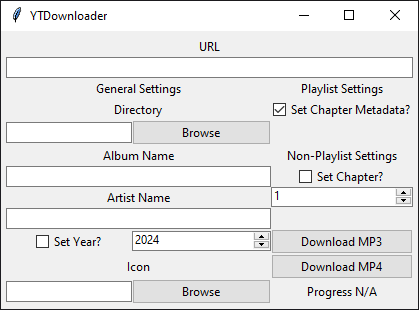

# YTDownloader
I made this python application because I'm sick and tired of all those dumb websites that are terrible at the one thing they set out to do. Turns out it's actually realy easy to download youtube videos. I haven't actually tested the max quality this is capable of - one way to find out!  

## Ways to Run
There are two versions packed into one .exe file: command-line and gui. These both do the same thing, and I'll explain each feature a little later.

### Command-line
To run this version of the program, run the program with more than zero command line arguments (e.g. `-h`).

#### Usage
```apache
Usage: ./YTDownloader.exe [-h] [-a ALBUM] [-A ARTIST] [-c CHAPTER] [-C] [-i ICON] [-n NAME] [-o OUTPUT] [-u URL] [-v] [-y YEAR]
To run using a GUI, run with no command line arguments

OPTIONS:
  -a, --album           <NAME>  Album name for folder and metadata.
  -A, --artist          <NAME>  Artist name for metadata.
  -c, --chapter         <NUM>   Chapter number for non-playlist downloads.
  -C, --set-chapters            Set chapters for metadata for MP3s in playlists.
  -i, --icon            <PATH>  Path to ico/png/jpg/jpeg file to use as file icon/s
  -o, --output          <PATH>  Base output folder (default: downloads/audio or downloads/video).
  -u  --url             <URL>   URL for youtube video or playlist.
  -v, --video                   Download as MP4 instead of MP3.
  -y, --year            <YEAR>  Year to include in the metadata.
```

### GUI
To run using a GUI, run with no command line arguments. I made two versions of this because my friend liked the retro look.  

#### Retro


#### Updated
tbd
<!-- TODO: picture of normal version -->

## Functionality
There are quite a few functions that the script can handle, most of them are optional. However, you will need to give a URL and filetype.

### Required
#### URL
The URL can be given for a single video, or for an entire playlist. The application will figure out which one you've given, so there's no need to have an option for it.  
Command line option: `-u <URL>` or `--url <URL>`

#### Filetype
You need to set if you want to download as MP3 (audio), or MP4 (video). In the GUI, you can select the filetype by clicking the different buttons for `Download MP3` or `Download MP4`. To download as MP4 in command-line, provide the `-v` or `--video` option. The command-line application will download as MP3 if no `video` flag is set.

### Optional - General
#### Output Directory

#### Album

#### Artist

#### Year

#### Icon

### Optional - Playlists
#### Set Chapters

### Optional - Non-Playlists
#### Chapter

## Compilation
If you want to take the python code and build it in to an executable (useful if you wanna make some changes of your own), you can use PyInstaller - `pip install pyinstaller`. Here is a basic command you can use to compile:  

```bash
pyinstaller --onefile --name YTDownloader downloader.py
```

This will give you an executable called `YTDownloader.exe` and put it into the `dist` folder.